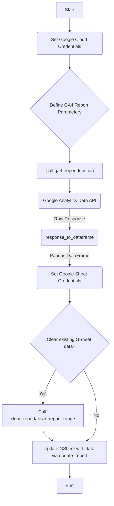

# ga_to_sheet

## Description
This project provides a Python script to extract data from Google Analytics 4 (GA4) and push it to Google Sheets. It leverages the Google Analytics Data API (Beta) and Gspread for Google Sheets integration.

## Files
```
C:.
├── .git/
│   ├── COMMIT_EDITMSG
│   ├── FETCH_HEAD
│   ├── HEAD
│   ├── ORIG_HEAD
│   ├── config
│   ├── description
│   ├── hooks/
│   │   ├── applypatch-msg.sample
│   │   ├── commit-msg.sample
│   │   ├── fsmonitor-watchman.sample
│   │   ├── post-update.sample
│   │   ├── pre-applypatch.sample
│   │   ├── pre-commit.sample
│   │   ├── pre-merge-commit.sample
│   │   ├── pre-push.sample
│   │   ├── pre-rebase.sample
│   │   ├── pre-receive.sample
│   │   ├── prepare-commit-msg.sample
│   │   ├── push-to-checkout.sample
│   │   ├── sendemail-validate.sample
│   │   └── update.sample
│   ├── info/
│   │   └── exclude
│   ├── logs/
│   │   ├── HEAD
│   │   ├── refs/
│   │   │   ├── heads/
│   │   │   │   ├── main
│   │   │   │   └── master
│   │   │   ├── remotes/
│   │   │   │   ├── origin/
│   │   │   │   │   ├── main
│   │   │   │   │   └── master
│   │   │   │   └── origin
│   │   │   └── heads
│   │   └── refs
│   ├── objects/
│   │   ├── 01/
│   │   │   └── 23fe9e39c244af8b2768527e26bc0078712724
│   │   ├── 0e/
│   │   │   └── 6f467ed897995c685b7350b282eff81daa571b
│   │   ├── 11/
│   │   │   └── 6bfe3bdd25008f72ec80776adca7e30ab19266
│   │   ├── 12/
│   │   │   └── dab34de10802ffb3dbba48b90dc10a162804c5
│   │   ├── 2d/
│   │   │   └── bcc9b18286980b8979e570450773021acf1b99
│   │   ├── 44/
│   │   │   └── 6ca07e985e0b9a7849869e09e9a77192c0addf
│   │   ├── 49/
│   │   │   └── efa56e7f6ce04de97b9760e41540e14c351028
│   │   ├── 4b/
│   │   │   └── 825dc642cb6eb9a060e54bf8d69288fbee4904
│   │   ├── 59/
│   │   │   └── 647af65b1f7a0514fbc60897513b0d5af9e4e8
│   │   ├── 65/
│   │   │   └── 9ac13146b9230142ee68f4975ca89c89ea2008
│   │   ├── 90/
│   │   │   └── 40ada61b14fcf8e9c6744414c496abacdb3999
│   │   ├── 98/
│   │   │   └── 2340787db7df965f727166486590c98f4286b3
│   │   ├── a5/
│   │   │   └── 9d0700f3aec8dae053028d11bf59512f557062
│   │   ├── c3/
│   │   │   └── 8406b570b173b7777b437c234d4c683e5b985c
│   │   ├── c5/
│   │   │   └── 3fd79147eebede065f112a999f863a523ea15e
│   │   ├── c7/
│   │   │   └── 8200b039dc290b22cf2993f4c028a36a12f23d
│   │   ├── ca/
│   │   │   └── e298f3ff9dd5cf1ef32ee8aac743a2b39a5a7b
│   │   ├── d3/
│   │   │   └── 445ca84c772f0df56c75fa55fd49180bf0af67
│   │   ├── d5/
│   │   │   └── 9c2962546547984224b77f397a3cd67bf48b54
│   │   ├── d7/
│   │   │   └── 2a0e7375d6cea4600374be6bcf2ae080038fd1
│   │   ├── d9/
│   │   │   └── daeb3ce76cf01fe18419c883764415f29d49f2
│   │   ├── df/
│   │   │   └── d6a462563779744c72a88e5dc0f0a7b6360501
│   │   ├── ea/
│   │   │   └── 1f6a4c1444882662abd220aff1fafe1609831d
│   │   ├── ee/
│   │   │   └── 963afdd9c47c6a04f22897f12b96e92adb39d9
│   │   ├── info/
│   │   ├── pack/
│   │   └── readme.txt
│   └── refs/
│       ├── heads/
│       │   ├── main
│       │   └── master
│       ├── remotes/
│       │   ├── origin/
│       │   │   ├── main
│       │   │   └── master
│       │   └── origin
│       └── tags/
└── ga_to_gsheet.py
```

## Setup & Usage

### Dependencies
The script relies on the following Python libraries:
*   `google-analytics-data`
*   `pandas`
*   `google-oauth2`
*   `gspread`
*   `numpy`

You can install them using pip:
```bash
pip install google-analytics-data pandas google-oauth2 gspread numpy
```

### Authentication
The script uses service account credentials for both Google Analytics Data API and Google Sheets API. Ensure your `credentials` file (JSON key file) is properly configured and accessible.

### Functions

*   `response_to_dataframe(response)`: Converts a `RunReportResponse` object from the GA4 Data API into a Pandas DataFrame.
*   `ga4_report(date_range, property_id, dimensions_name, metrics_name, dim_filter, credentials)`: Fetches data from a specified GA4 property.
    *   `date_range`: List of two strings `[start_date, end_date]` in 'YYYY-MM-DD' format.
    *   `property_id`: Your GA4 property ID (e.g., "123456789").
    *   `dimensions_name`: List of dimension names (e.g., `["date", "sessionSource"]`).
    *   `metrics_name`: List of metric names (e.g., `["activeUsers", "sessions"]`).
    *   `dim_filter`: Optional `FilterExpression` for dimension filtering.
    *   `credentials`: Path to your Google service account JSON key file.
*   `clear_report(serv_account, sheet_name, worksheet_name)`: Clears all content from a specified worksheet in a Google Sheet.
    *   `serv_account`: Path to your Google service account JSON key file.
    *   `sheet_name`: The name of the Google Sheet.
    *   `worksheet_name`: The name of the worksheet within the Google Sheet.
*   `update_report(serv_account, sheet_name, worksheet_name, item, pos)`: Updates a specified range or cell in a Google Sheet worksheet.
    *   `serv_account`: Path to your Google service account JSON key file.
    *   `sheet_name`: The name of the Google Sheet.
    *   `worksheet_name`: The name of the worksheet within the Google Sheet.
    *   `item`: The data to update (e.g., a list of lists for rows).
    *   `pos`: The A1 notation of the starting cell (e.g., "A1").
*   `clear_report_range(serv_account, sheet_name, worksheet_name, range)`: Clears a specific range of cells within a Google Sheet worksheet.
    *   `serv_account`: Path to your Google service account JSON key file.
    *   `sheet_name`: The name of the Google Sheet.
    *   `worksheet_name`: The name of the worksheet within the Google Sheet.
    *   `range`: A list of A1 notations for ranges to clear (e.g., `["A1:Z100"]`).

## Flowchart
